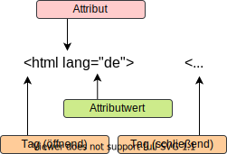

# HTML-Grundlagen

## Was ist HTML

HTML steht für ``Hypertext Markup Language``  und stellt damit eine grundlegende Auszeichnungssprache für die formatierte Darstellung von textbasierten Inhalten in Webbrowsern dar.

Im Folgenden beschäftigen wir uns mit dem grundlegenden Aufbau einer HTML-Datei.

### Grundgerüst

````html
<!DOCTYPE html>
<html lang="de">
<head>
    <meta charset="UTF-8" />
    <meta name="author" content="Name des Autors">
    <meta name="description" content="Beschreibung der Website">
    <meta name="keywords" content="it, html, web, schule, kolleg">
    <title>Titel</title>
</head>
<body>

</body>
</html>
````

Das Beispiel zeigt das minimal erforderliche Gerüst einer HTML-Datei. Grundsätzlich ist der Aufbau recht simpel. Schauen wir uns zunächst die erste Zeile an:

````html
<!DOCTYPE html>
````

Dies teilt dem Browser oder Server lediglich mit, das es sich um den Dokumententyp ``html`` handelt. Denkbar wären hier auch noch andere Formate wie ``xml``.

Alle weiteren Elemente einer html-Datei werden innerhalb des <html>-Tags geschrieben.

````html
<!DOCTYPE html>
<html lang="de">

<!-- Hier landet der Inhalt. --> 

</html>
````

Noch ein kleiner, aber entscheidender Hinweis zu den Tags:



Ein HTML-Tag besteht immer aus zwei Teilen, dem ``[öffnenden]``  und dem ``[schließenden]`` Teil.
Allerdings gibt es auch hier Ausnahmen. Das ``<meta>``-Tag stellt eine davon dar.
Wie du gesehen hast, hat es nämlich kein schließendes Tag ``</meta>`` , sondern folgendes Schema: ``<meta />``

Allerdings darf das ``/``-Zeichen auch weggelassen werden, also ``<meta name="a" content="b">`` 

Zwischen ``<html>``  und ``</html>``  (also innerhalb des ``<html>``-Tags), werden wir zwei Bereiche erstellen:

1. Head - die "Meta-Ebene"
2. Body - die "visuelle Ebene"

## Head

````html
<head>
    <meta charset="UTF-8" />
    <title>Titel</title>
</head>
````

Im HTML-Kopf stehen Angaben, die das HTML-Dokument näher beschreiben.
Neben Informationen für den Browser oder Suchmaschinen werden hier etwa auch ausgelagerte sogenannte ``[Style Sheets]`` eingebunden.
Dazu später mehr. Innerhalb des <head>-Tags im o.a. Beispiel befinden sich zwei weitere Tags,
nämlich ``<meta></meta>`` und ``<title></title>``.

Das ``<meta>``-Tag hat das Attribut ``charset`` mit dem Wert ``UTF-8``.
Charset gibt an, mit welcher Zeichencodierung das Dokument gelesen werden soll.

Theoretisch sind unendlich viele weitere ``<meta>``-Tags möglich,
die alle nach dem gleichen Prinzip aufgebaut sind:

````html
<meta name="Name des Meta-Attributs" content="Attributwert des Meta-Attributs" />
````

Wie du siehst, hat das ``<meta>``-Tag normalerweise zwei Attribute, nämlich:

1. ``name``, gibt an, wie das aktuelle Meta-Attribut benannt sein soll
2. ``content``, gibt an, welchen Inhalt/Wert das aktuelle Meta-Attribut haben soll

### Beispiel

````html
<meta name="author" content="Autor der Website" />
<meta name="description" content="Inhaltsbeschreibung der Website" />
````

Das ``<title>``-Tag wird benutzt, um den Titel der HTML-Datei anzugeben.
Dieser wird in der Titelleiste des Browsers angezeigt.

## Body

````html
<body>
    Meine erste Website
</body>
````

Innerhalb des ``<body>``-Tags wird alles hineingeschrieben,
das dann auch tatsächlich im Browser angezeigt werden soll.